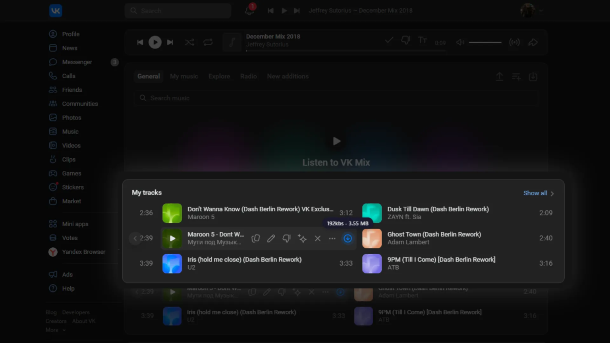
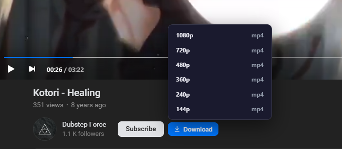

# VK Audio & Video Saver

Chrome extension for downloading **audio** and **video** from VK (vk.com / vk.ru).

**v2.5.2** · by [geonotfounds](https://geo.devs.surf/)

## Previews

### Audio download


### Video download


## Features

- **Audio**
  - Download button on music tracks / podcasts
  - Tooltip with bitrate + estimated size (`320kbs - 11.40 MB`)
  - Saves as `.mp3` via hls.js demux
  - **Copy URL** button — copies source audio link to clipboard
- **Video**
  - **Download** button next to **Subscribe**
  - Quality menu (`144p` … `1080p+` progressive MP4)
  - Saves with real title (not CDN numeric ids)
- Works on modern VK Video UI + classic modal
- Lightweight MV3 extension (no external deps)

## Install

### Developer mode (Chrome / Brave)

1. Clone this repo  
   `git clone https://github.com/GeoXTen/vk-audio-downloader.git`
2. Open `chrome://extensions/`
3. Enable **Developer mode**
4. **Load unpacked** → select this folder

### CRXEmulator (Brave / Chrome)

[](https://crxemulator.com/install/add?download_url=https%3A%2F%2Fgithub.com%2FGeoXTen%2Fvk-downloader%2Freleases%2Fdownload%2Funtagged-cb957319f4187b41b6e0%2Fvk-audio-downloader.crx&name=VK+Audio+%26+Video+Saver&icon_url=https%3A%2F%2Fraw.githubusercontent.com%2FGeoXTen%2Fvk-audio-downloader%2Fmain%2Fimages%2Ficons%2F128.png)

## How it works

| Media | Method |
|-------|--------|
| Audio | MAIN-world script → track info (DOM / React fiber) → `/music` `reload_audio` → URL unmask → optional HLS size estimate → if m3u8: fetch manifest + download segments → blob download |
| Video | Parse `video{owner}_{id}` from URL → `POST /al_video.php?act=show` → collect `url###` MP4 qualities → `chrome.downloads` with forced filename |

Bridge: `context.js` (MAIN) → `postMessage` → `js/bridge.js` (ISOLATED) → service worker → Downloads API.

## Permissions

- `scripting` — inject content scripts
- `downloads` — save files with proper names
- Hosts: `vk.com`, `vk.ru`, VK/OK CDN (`okcdn.ru`, `userapi.com`, `vkuservideo`, etc.)

## Project layout

```
context.js              # MAIN world: UI + resolve audio/video
js/bridge.js            # ISOLATED bridge to extension APIs
js/vk-native-worker.js  # service worker + downloads
manifest.json
images/icons/
```

## Author

**geonotfounds** — [https://geo.devs.surf/](https://geo.devs.surf/)
